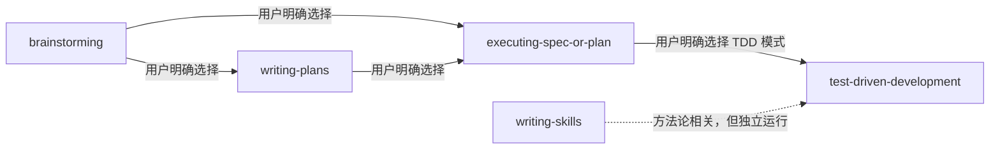
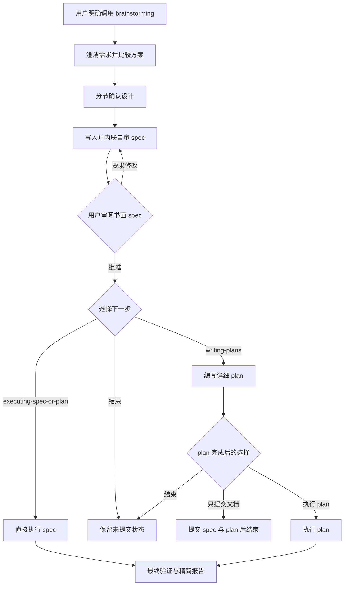
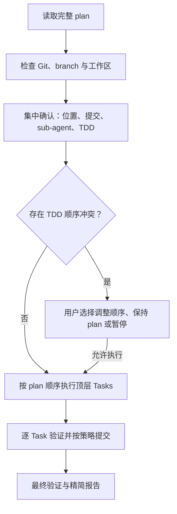
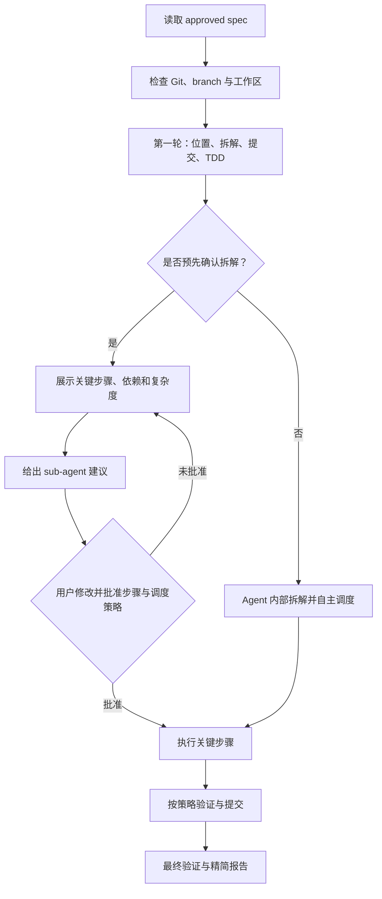

# Hyperpowers Wiki

本文档说明 Hyperpowers 与原版 [Superpowers](https://github.com/obra/superpowers) 的主要差异、五个保留技能的调整原因，以及精简版的完整工作流程。

## 项目定位

Superpowers 提供了一套覆盖设计、规划、实现、测试、调试、review、分支收尾和 sub-agent 调度的完整技能体系。多个技能会自动衔接，使 Agent 能够在较少人工干预下持续推进。

Hyperpowers 只保留其中五个核心能力：

1. 把想法整理为 spec；
2. 把 spec 转换为 plan；
3. 执行 spec 或 plan；
4. 使用 TDD 编写代码；
5. 编写和验证 Skill。

精简不只是删除目录，还包括重新定义技能之间的调用关系。保留的 Skill 都是完整、可独立使用的能力，而不是必须依赖整套工作流才能运行的中间步骤。

## 核心设计原则

### 1. 用户显式调用

所有 Skills 都采用 explicit activation：

- 用户明确要求使用某个 Skill，才加载它；
- 用户明确选择一个写有 Skill 名称的选项，也视为授权；
- 语义匹配、文档提及、模糊的“继续”或 Agent 自己的判断都不是授权；
- 否定使用或仅询问 Skill 功能同样不会触发。

### 2. 技能之间默认解耦

Skill 可以：

- 说明另一个 Skill 与当前流程的关系；
- 在流程末尾把另一个 Skill 作为可选项；
- 在用户明确选择后把当前产物交给另一个 Skill。

Skill 不可以：

- 把另一个 Skill 声明为必需依赖；
- 读取到某个 plan 或 spec 后自动加载另一个 Skill；
- 把“批准”“继续”解释为调用后续 Skill；
- 通过隐藏的调度流程绕过用户选择。

### 3. 自动化服务于质量，而不是替代决策

内联自审、测试、最终验证、依赖分析和复杂度判断仍可由 Agent 自动完成。这些动作主要影响结果质量，不会在用户不知情时改变分支、提交代码或跳转到新的工作模式。

需要改变工作方式的决策则交给用户，例如：

- 在哪里执行；
- 是否提交；
- 是否采用 TDD Skill；
- 是否预先确认任务拆解；
- 是否使用 sub-agent。

### 4. 每个流程都有结束方式

生成 spec 或 plan 后，用户都可以选择到此结束。执行结束后也不会自动 merge、push、创建 PR 或清理 branch/worktree。

## 与原版的整体差异

| 维度 | 原版 Superpowers | Hyperpowers | 调整目的 |
|---|---|---|---|
| 技能范围 | 覆盖完整开发生命周期 | 只保留五个核心技能 | 减少需要理解和维护的流程 |
| 激活方式 | 倾向根据任务自动发现和触发 | 只接受用户显式调用 | 避免任务匹配直接改变工作模式 |
| 技能关系 | 多个流程存在强制或固定衔接 | 默认解耦，后续 Skill 只是选项 | 让每个阶段可以独立结束 |
| spec 完成后 | 进入后续计划流程 | 用户选择写 plan、直接执行或结束 | 把流程控制权交还用户 |
| plan 执行 | 主要执行详细实施计划 | 同时支持 plan 与 approved spec | 允许跳过正式 plan 文档 |
| Git commit | 多个流程内置提交步骤 | 文档和执行分别定义提交策略 | 区分“内容完成”和“授权提交” |
| sub-agent | 有专门的调度工作流 | 使用 Agent 原生能力，并由用户控制策略 | 降低调度机制与技能内容的耦合 |
| TDD | 与编码任务自动绑定 | 只有用户明确选择才加载 TDD Skill | 区分普通测试与严格 TDD 工作模式 |
| review | 可进入独立 review 流程 | 保留内联自审与最终验证 | 减少额外流程跳转 |
| 收尾 | 可进入分支完成工作流 | 精简报告，不自动 merge、push 或清理 | 避免完成代码后继续改变仓库状态 |

这些差异代表不同的交互取向，不表示某一种方式在所有场景中都更好。

## 五个技能分别做了什么调整

### `brainstorming`

**保留的核心功能**

- 探索项目上下文；
- 每次提出一个澄清问题；
- 给出 2–3 种方案及取舍；
- 分节展示设计并获得确认；
- 写入 `docs/superpowers/specs/`；
- 用户反复审阅和修改，直到明确批准。

**精简后的变化**

- 只有用户明确要求时才进入 brainstorming hard gate；
- spec 写完后固定保持未提交；
- 自动 reviewer 改为当前 Agent 的内联自审；
- 用户批准书面 spec 后，不再固定进入 planning，而是提供三个选项：
  1. 使用 `writing-plans`；
  2. 使用 `executing-spec-or-plan` 直接执行 spec；
  3. 到此结束。
- 视觉设计不再强制特定 server、runtime 或渲染脚本，由 Agent 根据当前能力选择 HTML、Mermaid、SVG 或字符表示。

**为什么这样调整**

brainstorming 的价值在于澄清和审阅，不在于替用户决定下一步，也不应因为生成一份设计文档就自动改变 Git 状态。

### `writing-plans`

**保留的核心功能**

- 把 approved spec 或明确 requirements 写成详细 plan；
- 先确定文件结构和职责；
- 使用可执行的顶层 Tasks 和小步骤；
- 保留失败测试、最小实现、验证和 commit 步骤；
- 禁止 `TBD`、`TODO` 和含糊占位符；
- 写完后执行内联自审。

**精简后的变化**

- 只有用户明确要求时才编写 plan；
- plan 文档写完后保持未提交；
- 不要求先创建 worktree；
- 不强制选择某种 sub-agent 执行模式；
- 完成后提供三个选项：
  1. 只提交 plan 和来源 spec，然后结束；
  2. 使用 `executing-spec-or-plan`；
  3. 不提交，直接结束。

**为什么这样调整**

计划文档中的 commit 步骤属于未来执行契约，而 plan 文件自身是否提交属于当前用户决策。两者需要明确区分。

### `executing-spec-or-plan`

这是本项目变化最大的 Skill。

**保留的核心功能**

- 阅读完整输入；
- 识别阻塞、歧义和依赖；
- 按 Task 或关键步骤执行；
- 运行测试和验证；
- 失败时停止并报告；
- 最终核对完成范围。

**精简后的变化**

- 从 `executing-plans` 扩展并更名为 `executing-spec-or-plan`；
- 可以执行完整 plan，也可以直接执行 approved spec；
- 执行 spec 时不会生成正式 plan 文档；
- 在实施前先检查 Git、branch 和工作区状态；
- 一次性展示需要用户决定的维度；
- 根据输入类型提供不同的 commit、拆解和 sub-agent 策略；
- TDD 只有被明确选择时才调用；
- sub-agent 使用当前 Agent 的原生能力，不再依赖单独的调度 Skill；
- 完成后只验证和报告，不自动进入 merge、push、PR 或清理流程。

**为什么这样调整**

执行是最容易产生外部状态变化的阶段。先把关键选择集中展示，可以减少逐个追问，也让用户在编码开始前知道 Agent 将在哪里修改、是否提交、如何拆解，以及会不会改变执行模式。

### `test-driven-development`

**保留的核心功能**

- `NO PRODUCTION CODE WITHOUT A FAILING TEST FIRST`；
- RED：编写最小失败测试；
- 验证 RED：确认测试因正确原因失败；
- GREEN：编写最少实现；
- 验证 GREEN：确认目标与相关测试通过；
- REFACTOR：在绿灯下整理；
- 强调真实行为、独立期望值和谨慎使用 mock。

**精简后的变化**

- 只有用户明确要求或在 executor 中明确选择 TDD 模式时才激活；
- 不负责 Git commit、branch 或 worktree；
- “删除提前实现并重来”增加了所有权边界：
  - 只能删除当前 Agent 在当前任务中为当前行为提前写出的实现；
  - 不能删除 legacy code；
  - 不能删除用户或其他 Agent 的未提交修改；
  - 来源不明时必须停止询问；
  - 修改含用户未提交内容的文件时使用最小 patch。

**为什么这样调整**

严格 TDD 仍然有价值，但纪律约束不能成为删除既有代码或用户工作的理由。显式激活也让用户能够区分“Agent 会写测试”和“本次严格按 TDD 顺序执行”。

### `writing-skills`

**保留的核心功能**

- 用 RED–GREEN–REFACTOR 测试 Agent 行为文档；
- 在没有新 guidance 时建立 baseline；
- 使用 pressure scenarios 暴露真实失败；
- 用 fresh context 验证 Skill 是否改变行为；
- 处理 rationalization，并执行回归验证。

**精简后的变化**

- 作为独立 Skill 运行，不强制调用 TDD；
- fresh context 可以来自 sub-agent、新会话、API 或 eval harness；
- 没有隔离测试能力时允许保留草稿，但不能声称已验证；
- 新 Skill 默认采用 explicit activation，除非用户明确要求 automatic discovery；
- 删除对固定 runtime、路径和脚本的强制要求；
- 完成后固定保持未提交，不提供自动 commit 或 push 选项。

**为什么这样调整**

Skill 是行为程序，需要通过真实行为测试验证；但测试方法不应绑定某一种调度实现。完成 Skill 编写也不等于获得发布或提交授权。

## 技能之间的关系

技能之间只有建议和显式选择关系：

| 来源 Skill | 可建议的目标 | 触发条件 |
|---|---|---|
| `brainstorming` | `writing-plans` | 用户明确选择写 plan |
| `brainstorming` | `executing-spec-or-plan` | 用户明确选择直接执行 spec |
| `writing-plans` | `executing-spec-or-plan` | 用户明确选择执行 plan |
| `executing-spec-or-plan` | `test-driven-development` | 用户明确选择 TDD Skill 模式 |
| `writing-skills` | 无必需目标 | 只说明与 TDD 共享方法论 |
| `test-driven-development` | 无 | 独立执行 TDD 纪律 |

## 精简版主工作流程

用户也可以跳过 brainstorming，直接明确调用某个 Skill。流程图表达的是完整链路，不是强制入口。

## 执行前需要用户决定什么

`executing-spec-or-plan` 不会在读取输入后立即修改代码。它先执行只读检查，再集中展示需要用户决定的事项。

### Agent 先自动检查的信息

这些内容由 Agent 获取，不要求用户重复提供：

- 当前工作目录；
- 是否为 Git 仓库；
- 当前 branch；
- 当前 branch 是否为 `main` 或 `master`；
- staged、unstaged 和 untracked 状态；
- 输入文档路径；
- 输入类型是完整 plan 还是 approved spec。

如果当前 branch 是 `main` 或 `master`，Agent 会醒目标注。用户在看到警告后仍明确选择当前分支，才构成直接修改主分支的授权。

### 用户需要决定的核心维度

| 决策维度 | 用户在决定什么 | 对执行的影响 |
|---|---|---|
| 执行位置 | 当前分支、新分支或 worktree | 决定代码写入哪里，以及是否创建新的 Git 工作区 |
| 提交策略 | 按 Task/关键步骤提交、遵循 plan，或不提交 | 决定 Agent 是否执行 Git commit，以及提交边界 |
| TDD 模式 | 明确使用 TDD Skill，或不调用 | 决定是否强制执行“先失败测试、再最小实现”的完整纪律 |
| 任务拆解 | 展示关键步骤并确认，或由 Agent 自主 | 决定用户是否在编码前审阅执行步骤 |
| sub-agent 策略 | 强制使用、Agent 判断或禁止使用 | 决定任务是否交给原生 sub-agent 调度 |
| Git 初始化 | 在非 Git 目录中是否执行 `git init` | 只在用户要求提交但当前没有仓库时出现 |

这些维度不是每条路径都同时询问。完整 plan 已经包含 Tasks，因此不再询问是否拆解；spec 没有完整步骤，因此先询问用户是否要审阅拆解结果。

## 完整 plan 的执行路径

完整 plan 路径集中收集四个主要决定，以及一个条件决定：

| 维度 | 选项 |
|---|---|
| 执行位置 | 当前分支／新分支／worktree |
| 提交策略 | 强制每个顶层 Task 提交／遵循 plan／明确不提交 |
| sub-agent | 强制使用／Agent 判断／禁止使用 |
| TDD | 使用 `test-driven-development`／不调用 |
| Git 初始化 | 仅在非 Git 目录且提交策略需要 commit 时出现 |

### 提交策略的三种含义

1. **强制每个顶层 Task 提交**
   - 每个 Task 完成并验证后提交一次；
   - 即使 plan 没写 commit，也按 Task 边界提交；
   - 没有文件变化的 Task 不创建空 commit。

2. **遵循 plan**
   - 只执行 plan 明确写出的 commit 步骤。

3. **明确不提交**
   - 跳过 plan 中所有 commit 指令；
   - 保留实现、测试和验证步骤；
   - 最终代码保持未提交。

### TDD 与 plan 冲突

如果用户选择 TDD，但 plan 中存在“先实现、后测试”，Agent 会在同一个 TDD 维度中让用户决定：

1. 使用 TDD，并只调整冲突 Task 的测试/实现顺序；
2. 保持 plan 顺序，不调用 TDD；
3. 暂停执行。

不会借此改变 architecture、功能范围或验收目标。

## 直接执行 spec 的路径

直接执行 spec 时，不创建 `docs/superpowers/plans/` 下的正式 plan，也不会自动调用 `writing-plans`。

### 第一轮集中确认

用户先决定四个主要维度和一个条件维度：

| 维度 | 选项 |
|---|---|
| 执行位置 | 当前分支／新分支／worktree |
| 任务拆解 | 展示关键步骤并确认／完全由 Agent 自主 |
| 提交策略 | 每个关键步骤提交／明确不提交 |
| TDD | 使用 `test-driven-development`／不调用 |
| Git 初始化 | 仅在必要时出现 |

### 如果选择完全由 Agent 自主

- Agent 内部形成关键步骤；
- 不再向用户展示或确认步骤；
- 不再单独询问 sub-agent；
- Agent 自主决定是否以及如何使用 sub-agent；
- 仍严格遵守用户已经选择的提交和 TDD 政策。

此路径适合用户只关心结果、不希望继续确认内部拆解的情况。

### 如果选择展示关键步骤并确认

Agent 会：

1. 阅读 spec 和代码库；
2. 列出关键步骤、依赖、复杂度和冲突风险；
3. 根据实际拆解给出 sub-agent 建议；
4. 允许用户修改关键步骤；
5. 再收集 sub-agent 策略：
   - 强制使用；
   - Agent 判断；
   - 禁止使用。
6. 只有步骤和调度策略都批准后才开始实施。

这意味着 sub-agent 确认是条件性的：只有用户要求预先审阅任务拆解时才出现。用户把拆解完全交给 Agent 时，调度也一并交给 Agent。

## Git 与安全边界

执行 Skill 遵守以下边界：

- 不覆盖或暂存无关的既有修改；
- 输入涉及的文件与用户修改重叠时，在实施前暂停；
- 新分支由用户指定名称或接受 Agent 建议后创建；
- worktree 只有用户明确选择时创建；
- 非 Git 目录中，只有用户要求 commit 才询问是否初始化；
- 没有有效 HEAD 时，不为了 worktree 擅自创建 bootstrap commit；
- TDD 不得删除 legacy code、用户修改或来源不明的实现；
- 平台不支持强制选择的 sub-agent 能力时，必须报告而不能假装执行。

## 流程结束方式

执行完成后只进行精简收尾：

1. 运行适合项目的最终验证；
2. 对照 plan 或 spec 检查覆盖范围；
3. 报告：
   - 已完成的 Tasks 或关键步骤；
   - 测试和验证结果；
   - 本次 commits；
   - 未提交文件；
   - 当前 branch；
   - worktree 路径（如果创建过）。
4. 保持 branch 和 worktree 原状。

不会自动执行：

- merge；
- push；
- 创建 PR；
- 删除 branch；
- 删除 worktree；
- 调用额外的收尾 Skill。
