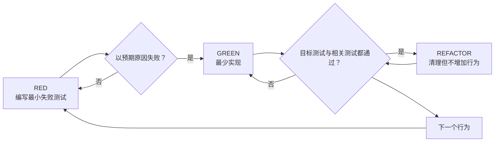

# 测试驱动开发（Test-Driven Development，TDD）

## 激活边界

本 Skill 只能由用户肯定地要求使用，或明确选择 TDD Skill 模式来激活。否定使用、询问功能、任务与描述相似、代码适合采用 TDD，或其他 Skill 仅提到了 TDD，都不构成激活授权。

激活后，本 Skill 是当前实现工作的执行约束；用户可以明确取消。取消后，Agent 可自行决定测试策略，但不得继续声称正在执行本 Skill。

本 Skill 不调用任何其他 Skill，也不负责 Git commit、push、merge、PR、分支或 worktree 操作。

## 概述

先写测试。观察它以正确原因失败。编写最少的实现使其通过。保持测试为绿，再做重构。

**核心原则：**如果没有亲眼看到测试失败，就无法确定它能捕获预期的缺失行为或回归。

## 铁律

```text
NO PRODUCTION CODE WITHOUT A FAILING TEST FIRST
```

对当前任务中新写的行为，生产代码之前必须先有一个因该行为缺失而失败的测试。

## 安全边界：删除之前先确认所有权

“测试之前写了代码就删除并重来”只适用于同时满足以下条件的代码：

1. 它是在当前任务中由当前 Agent 新写的；
2. 它专门用于当前正在实现的行为；
3. 删除不会移除用户的工作、既有功能或无关改动；
4. Agent 能从当前会话、diff 或版本状态确认其来源。

以下内容绝不能按 TDD 规则自动删除：

- 任务开始前已经存在的代码；
- legacy code；
- 用户或其他 Agent 的未提交修改；
- 来源不明的实现；
- 与当前行为共享、但还服务于其他功能的代码。

删除前先检查 diff、文件历史和改动范围。来源不明确时，停止并询问用户；不要猜测所有权。

修改含有既有未提交内容的文件时，使用最小范围 patch，并在修改前后对照 diff。若当前行为所需改动与用户已有区块重叠，先暂停并说明冲突，不能用整段重写覆盖。

### 已有代码与 bug 修复

修改既有代码时，不需要删除既有实现。应先添加一个能够复现缺陷或描述新行为的 regression test，确认它以预期原因失败，再对既有实现做最小修改。

### 当前任务中提前写出的实现

若当前 Agent 在激活 TDD 后，先写了当前行为的实现：

1. 暂停继续实现；
2. 核实这段代码确实完全属于当前任务；
3. 仅移除这段过早实现；
4. 写失败测试并运行；
5. 从测试出发重新实现。

不要把过早实现留作“参考”，也不要一边阅读它一边反向编写测试；那是 test-after，不是 TDD。

## 适用范围

激活后，默认用于当前任务中的：

- 新功能；
- bug 修复；
- 行为变更；
- 可观察行为会发生变化的重构。

如果当前工作是一次性探索、生成产物、纯配置或无法建立有效自动测试的任务，说明原因并向用户确认是否取消 TDD 或采用替代验证。不要静默跳过。

## RED → GREEN → REFACTOR



### 1. RED：编写一个最小失败测试

测试只描述一个可观察行为：

```typescript
test('retries a failed operation three times', async () => {
  let attempts = 0;
  const operation = async () => {
    attempts += 1;
    if (attempts < 3) throw new Error('temporary failure');
    return 'success';
  };

  await expect(retryOperation(operation)).resolves.toBe('success');
  expect(attempts).toBe(3);
});
```

要求：

- 名称清楚说明行为；
- 一次只测试一件事；
- 优先运行真实代码；
- 期望值独立推导，不复用被测实现；
- 除非真实依赖缓慢或外部，否则不用 mock。

编写或修改测试时，参考 [writing-good-tests.md](writing-good-tests.md)。

### 2. 验证 RED：亲眼观察失败

运行最小范围的相关测试，并确认：

- 测试是失败，而不是因为语法、导入、fixture 或环境问题报错；
- 失败消息与预期一致；
- 失败原因是目标行为尚不存在或 bug 仍可复现。

测试立即通过，说明它没有证明新行为缺失。修正测试或重新选择测试边界。

### 3. GREEN：编写最少实现

只实现让当前失败测试通过所必需的代码。

不要在这一阶段：

- 添加尚无失败测试要求的功能；
- 顺手重构无关代码；
- 提前设计未来扩展点；
- 修改测试来迎合错误实现。

### 4. 验证 GREEN：观察全部相关测试通过

重新运行目标测试，再运行与改动风险相称的相关测试。

确认：

- 新测试通过；
- 既有相关测试仍通过；
- 输出中没有需要处理的错误或警告。

若测试失败，优先修复实现。只有当需求或测试本身确实错误时才修改测试，并重新经历 RED。

### 5. REFACTOR：在绿灯下清理

测试保持为绿时，可以：

- 消除重复；
- 改进命名；
- 提取辅助函数；
- 简化结构。

重构不增加新行为。每次实质性整理后重新运行相关测试。

### 6. 重复

为下一个最小行为重新进入 RED。不要一次写出大量测试，再一次性实现全部功能。

## 好测试的最低标准

| 质量 | 应当 | 避免 |
|---|---|---|
| 最小 | 一个测试对应一个行为 | 一个名称里串联多个无关行为 |
| 清晰 | 名称描述输入、条件和结果 | `test1`、`works` |
| 有效 | 能说明哪种生产代码破坏会使它失败 | 只验证源码文本或常量存在 |
| 真实 | 断言可观察结果与副作用 | 只断言 mock 被调用 |
| 独立 | 人工推导 expected value | 用被测代码构造 expected value |

## Bug 修复示例

**Bug：**表单接受空 email。

**RED**

```typescript
test('rejects an empty email', async () => {
  const result = await submitForm({ email: '' });
  expect(result.error).toBe('Email required');
});
```

运行并确认它因当前错误行为而失败。

**GREEN**

```typescript
function submitForm(data: FormData) {
  if (!data.email?.trim()) {
    return { error: 'Email required' };
  }
  // existing behavior
}
```

运行目标测试与相关回归测试。全部通过后，才可重构重复的字段校验。

## 常见自我合理化

| 借口 | 事实 |
|---|---|
| “太简单，不需要测试” | 简单行为也会回归；先证明测试能失败。 |
| “先实现，稍后补测试” | test-after 没有证明测试能捕获缺失行为。 |
| “我已经手动测试过” | 手动检查不可稳定复现，也不能持续防回归。 |
| “保留实现作为参考” | 参考实现会影响测试设计，使测试追随实现。 |
| “已有代码没有测试” | 先为本次要改变的行为建立 regression test。 |
| “删除很浪费” | 只删除当前 Agent 在当前任务中提前写出的实现；既有或来源不明代码必须保护。 |
| “TDD 太慢” | RED 提前暴露错误假设，减少后期定位与返工。 |
| “这次情况特殊” | 说明具体限制并让用户决定是否取消，不要静默例外。 |

## 危险信号

出现以下情况时暂停：

- 当前行为的实现先于测试；
- 新测试第一次运行就通过；
- 无法解释失败为何证明目标行为缺失；
- 测试只断言 mock、源码文本或私有结构；
- 为让错误实现通过而改测试；
- 想自动删除既有、用户未提交或来源不明的代码；
- 说“稍后再补测试”；
- 只做手动验证却仍声称采用 TDD。

如果问题是过早实现，按“安全边界”处理；如果问题是测试设计，回到 RED。

## 遇到困难时

| 问题 | 处理 |
|---|---|
| 不知道如何测试 | 先写期望 API 和可观察结果，再写断言。 |
| 测试过于复杂 | 接口或职责可能过于复杂，缩小行为并简化设计。 |
| 必须 mock 一切 | 耦合可能过紧；把外部边界隔离，保留核心行为真实。 |
| fixture 很庞大 | 提取测试 helper；仍复杂则重新审视接口。 |
| 无法自动化 | 说明限制，提出可重复的替代验证，并让用户决定是否取消 TDD。 |

## 完成检查

在声称当前 TDD 工作完成前确认：

- [ ] 每个新增或改变的行为都有对应测试；
- [ ] 每个新测试都曾以预期原因失败；
- [ ] 失败不是由测试代码错误或环境错误造成；
- [ ] 实现是让测试通过所需的最小改动；
- [ ] 目标测试与相关测试全部通过；
- [ ] 重构期间测试保持为绿；
- [ ] 测试优先验证真实行为；
- [ ] 边界条件和错误路径与风险相称；
- [ ] 没有删除既有、用户未提交或来源不明的代码；
- [ ] 没有把 Git 操作归因于本 Skill。

无法满足时，准确报告缺口；不要把不完整的 test-after 流程称为 TDD。

## 最终规则

```text
Production behavior → a test existed and failed first
Otherwise → it was not TDD
```

本规则只在用户显式激活本 Skill 后生效，并受代码所有权与安全删除边界约束。
